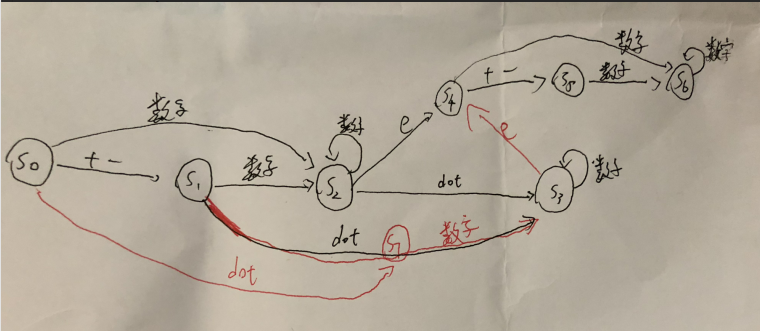

# 65.Valid Number

#### Description

Validate if a given string is numeric.

Some examples:
`"0"` => `true`
`" 0.1 "` => `true`
`"abc"` => `false`
`"1 a"` => `false`
`"2e10"` => `true`

**Note:** It is intended for the problem statement to be ambiguous. You should gather all requirements up front before implementing one.

**Update (2015-02-10):**
The signature of the `C++` function had been updated. If you still see your function signature accepts a `const char *` argument, please click the reload button to reset your code definition.

<br>

判断一个字符串是不是数字。

<br>


#### Solution

先来一个WA的做法，这个做法使用stringstream来转换，不过数字太大的时候会出错，如果能够成功转换，那么stringstream的rdstate()=ios::eofbit。要先去掉开头结尾空格。

```c++
class Solution {
public:
    bool isNumber(string s) {
        if( !s.empty() )
        {
            s.erase(0,s.find_first_not_of(" "));
            s.erase(s.find_last_not_of(" ") + 1);
        }
    
        stringstream s1(s);
        stringstream s2(s);
        long double x;
        s1>>x;
        if(s1.rdstate()!=ios::eofbit ) return false;
        return true;  
    }
};
```


接下来讲讲正确的做法。同样我们要先去掉字符串前后的空格。然后我们可以把按顺序遍历字符串的过程看成是状态的转移，没有遍历的时候是状态S0，转移图如下：



红色那部分是我一开始漏掉考虑的，也是经过了几次wa才试出来。状态s7的意义在于有“."这样的数据。

```C++
class Solution {
public:
    bool isNumber(string s) {
        if( !s.empty() )
        {
            s.erase(0,s.find_first_not_of(" "));
            s.erase(s.find_last_not_of(" ") + 1);
        }
    
        int state = 0;
        if (s.empty()) return false;
        
        for (auto x: s){
            if (x == '+' || x == '-'){
                if (state == 0 || state == 4) state++;
                else return false;
            }
            else if (x <= '9' && x >= '0'){
                if (state == 0 || state == 4) state += 2;
                else if (state == 1 || state == 5) state++;
                else if (state == 7) state = 3;
                else if (state != 2 && state != 3 && state != 6) return false;
            }
            else if (x == 'e'){
                if (state == 2 || state == 3) state = 4;
                else return false;
            }
            else if (x == '.'){
                if (state == 2) state++;
                else if (state == 1 || state == 0) state = 7;
                else return false;
            }
            else return false;
        }
        if (state == 2 || state == 3 || state == 6) return true;
        return false;
    }
};
```


[Content   首页](../README.md)&emsp;[51-100](../51-100.md)

